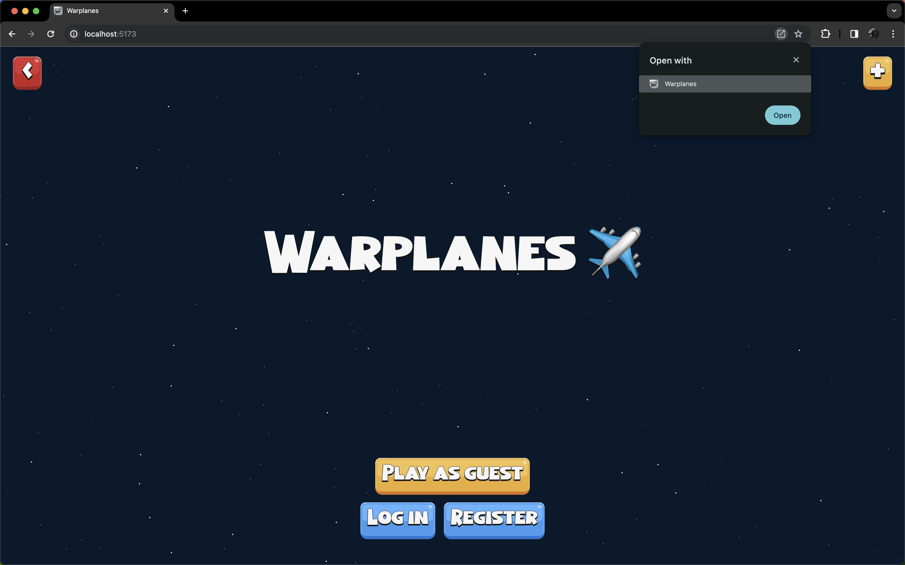
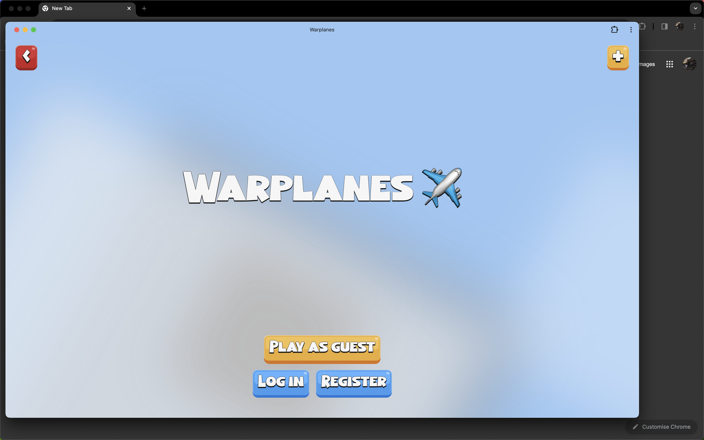
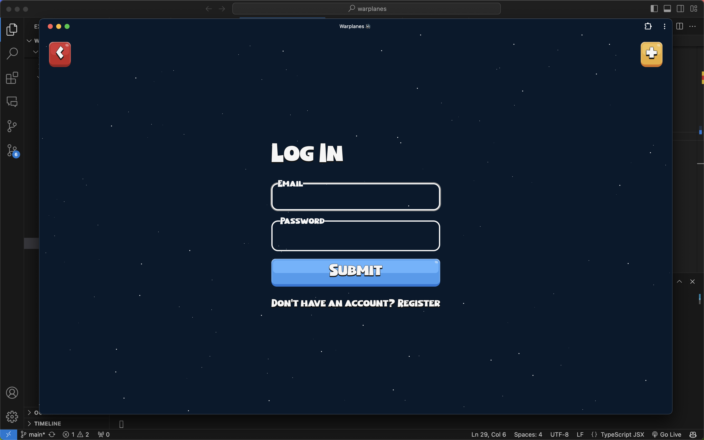
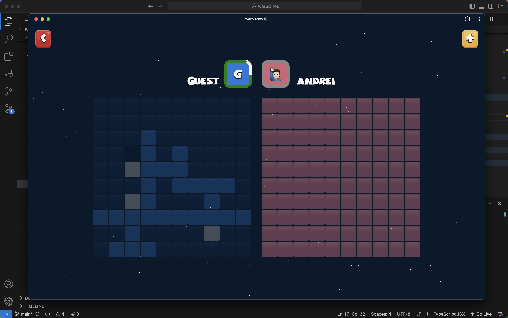
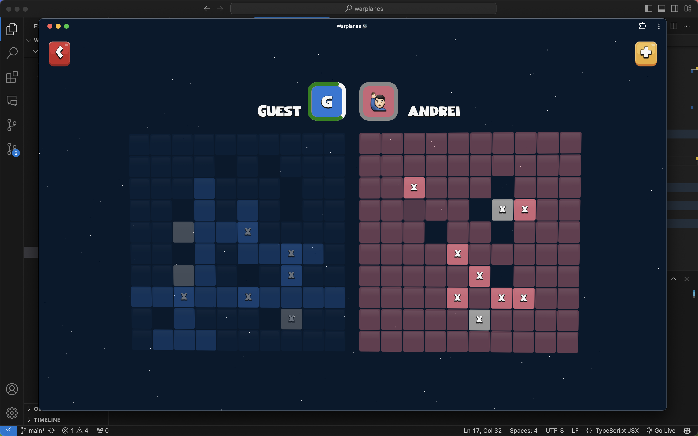
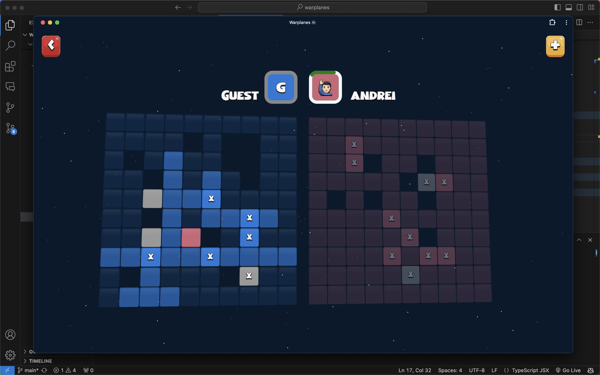
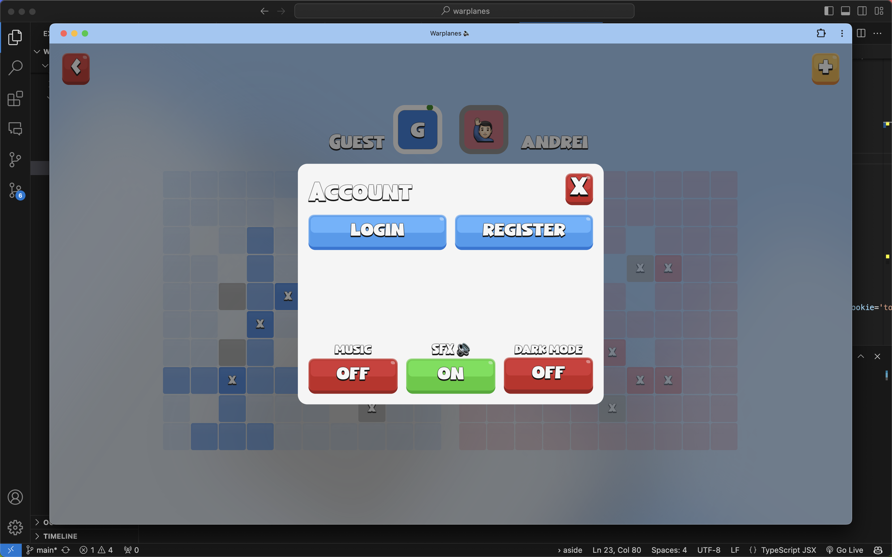

<style>
    body{
        background-color: #224;
        color: #f0f0f0;
    }
    h1{
        color: #f0f0f0;
        padding: 1rem;
        border-radius: 0.5rem;
    }
</style>

<h1 style="text-align: center; font-size: 4rem">Warplanes</h1>

> The game "Warplanes" is an adaptation of a popular childhood game, played between 2 opponents on paper called "Avioane".

## RULES:
- Each player has 2 "radars". In the first one, the player positions 3 planes, and in the second one tries to figure out the positions and hit the opponent's planes. The 2 radars are 10x10 matrices.

## THE GOAL:
- Destroy enemy planes by choosing positions on the game board. The game is similar to "Battleship", but instead of ships, players must find and destroy enemy planes.

___

The game can be played in singleplayer or multiplayer mode. In singleplayer mode, the player plays against an intelligent bot that has 3 difficulty levels, and in multiplayer mode, players can create secure accounts and link a connection through WebSockets where they can play against each other.

___

# INSTALLATION:

### 1. Clone the repository:  

```bash
git clone https://github.com/Vascool14/warplanes
```

### 2. Install and Run the "client":

```bash
cd client
npm install
npm run dev  # and open -> http://localhost:5173
```

### 3 (Optional). Install and Run the "server":

```bash
# continue ONLY if you want to run app online ⬇️
cd server
npm install
npm run dev # server open on PORT=8080 (depends on .env file)

# Need MongoDB account and create a cluster to connect to:
# Create ".env" file in the "server" directory:
MONGO_URI=.... # also hide it in the .gitignore ;)
```

___
















